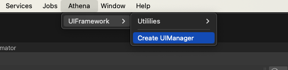
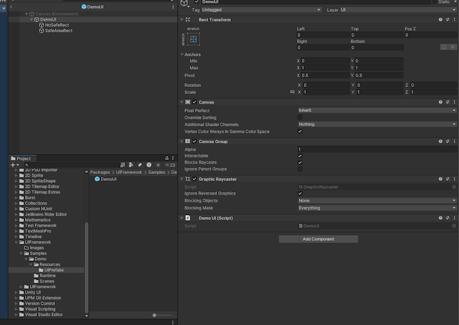

# UIFramework

UIFramework is a framework based on UGUI to help you setup, create and implement the UI in game easily.

## Installation

Add this git repository to your Packages/manifest.json to install.

```
{
  "dependencies": {
    "com.athena.uiframework": "https://github.com/thnthnh1/athena_framework.git#v1.0.1",
    ...
  }
}
```

To update the package, change suffix #{version} to the target version.

```
 "com.athena.uiframework": "https://github.com/thnthnh1/athena_framework.git#v1.0.2"
```


## Usage

Create UIManager in the scene by select: Athena -> UIFramework -> Create UIManager on the toolbar
<!-- CREATE UIMANAGER -->
<br />
<div align="left">
  <a href="">
    
  </a>
</div>


Create new class inheirits UIController for each UI that you want to implement.

```C#
using Athena.UIFramework;

public class DemoUI : UIController
{
    public void Setup()
    {

    }
}
```

Create new UI prefab at Resources/UIPrefabs/ and attach DemoUI to this prefab.
<!-- CREATE PREFAB -->
<br />
<div align="left">
  <a href="">
    
  </a>
</div>


Call UIManager's instance to show DemoUI

```C#
using UnityEngine;
using Athena.UIFramework;

public class SceneController : MonoBehaviour
{
    private void Start()
    {
        var demoUI = UIManager.Instance.ShowUIOnTop<DemoUI>("DemoUI", true, UILayer.Main);
        demoUI.Setup();
    }
}

```

There are 3 pre-defined layers to use and they follow this order:
"Game" < "Main" < Overlay

```C#
public static class UILayer
{
    public static int Game = 0;
    public static int Main = 1;
    public static int Overlay = 2;
}
```

## Note

Attach SafeArea.cs to the UI prefab that you want to show in the device safe area.
Attach SafeAreaSimulator to UIManager game object if you want to check the safe area in Editor.